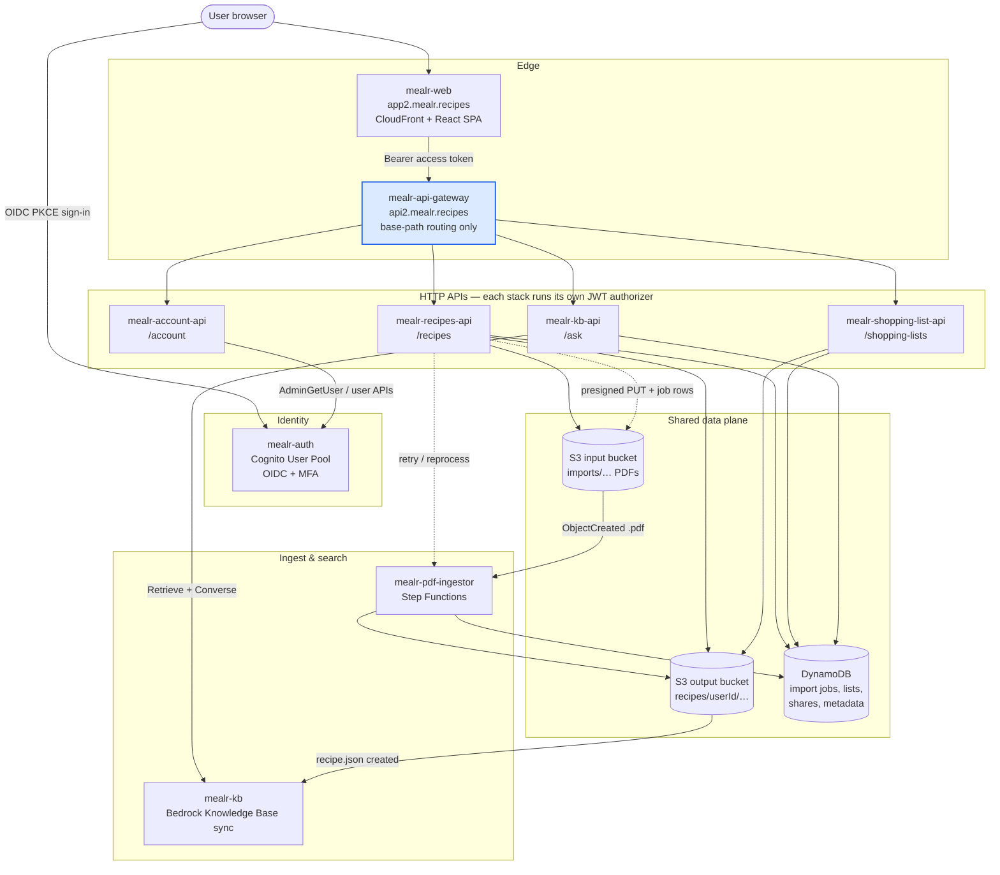
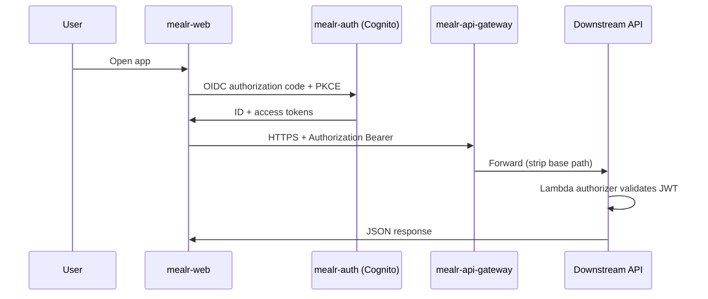
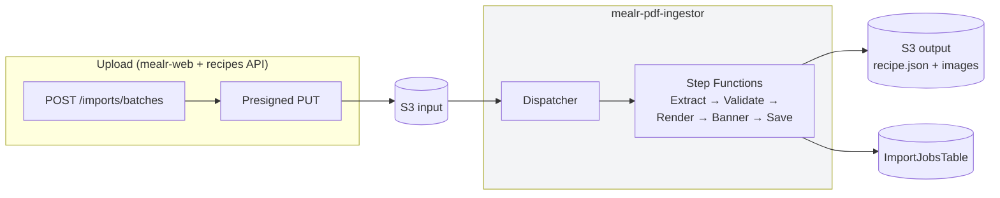
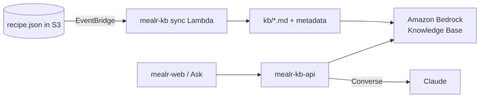

# Mealr platform architecture

High-level view of the Mealr system for operators and contributors. GitHub renders the Mermaid diagrams in this file natively.

## Table of Contents

- [System overview](#system-overview)
- [Authentication](#authentication)
- [API gateway](#api-gateway)
- [Recipe ingest pipeline](#recipe-ingest-pipeline)
- [Ask / knowledge base](#ask--knowledge-base)
- [This repository](#this-repository)
- [Repository map](#repository-map)

---

## System overview

Production hostnames shown are the current defaults (`app2.mealr.recipes`, `api2.mealr.recipes`). Each service stack can override domains via CDK context.

---

## Authentication

- **mealr-web** stores tokens client-side (`oidc-client-ts`) and attaches the **access token** to API calls.
- **mealr-api-gateway** routes only — it does not validate JWTs.
- Each HTTP API (**recipes**, **shopping-lists**, **ask**, **account**) runs its own Cognito JWT authorizer.

---

## API gateway

| Client path | Service | Notes |
|-------------|---------|--------|
| `https://api2.mealr.recipes/account/*` | mealr-account-api | Profile, password, MFA, passkeys |
| `https://api2.mealr.recipes/recipes/*` | mealr-recipes-api | Recipes, imports, shares, library |
| `https://api2.mealr.recipes/shopping-lists/*` | mealr-shopping-list-api | Shopping lists |
| `https://api2.mealr.recipes/ask/*` | mealr-kb-api | Recipe Q&A |

API Gateway **strips the base path** before forwarding (e.g. `GET /recipes/` → downstream `GET /`).

---

## Recipe ingest pipeline

**mealr-recipes-api** creates import job rows and presigned URLs; the **ingestor** owns the pipeline and writes structured recipes to the output bucket.

---

## Ask / knowledge base

**mealr-kb** indexes recipes for semantic search; **mealr-kb-api** retrieves context and generates answers with citations.

---

## This repository

**mealr-api-gateway** owns the shared API custom domain (`api2.mealr.recipes`) and **base-path mappings** to four downstream HTTP APIs. It contains no Lambda, no routes, and no authentication — only `CfnDomainName` + `CfnApiMapping` resources.

Path mappings: see repo `README.md` and `infra/gateway_stack.py`.

---

## Repository map

| Repository | Role |
|------------|------|
| [mealr-web](https://github.com/dbryant4/mealr-web) | React UI, CloudFront, `/assets` recipe images |
| **mealr-api-gateway** | **Custom domain + path mappings (this repo)** |
| [mealr-auth](https://github.com/dbryant4/mealr-auth) | Cognito user pool |
| [mealr-recipes-api](https://github.com/dbryant4/mealr-recipes-api) | Recipes, imports, shares, library |
| [mealr-shopping-list-api](https://github.com/dbryant4/mealr-shopping-list-api) | Shopping lists |
| [mealr-kb-api](https://github.com/dbryant4/mealr-kb-api) | Ask / Q&A API |
| [mealr-account-api](https://github.com/dbryant4/mealr-account-api) | Profile & security |
| [mealr-pdf-ingestor](https://github.com/dbryant4/mealr-pdf-ingestor) | PDF → JSON pipeline |
| [mealr-kb](https://github.com/dbryant4/mealr-kb) | Bedrock KB indexing |

Keep this document aligned across repos when platform wiring changes.