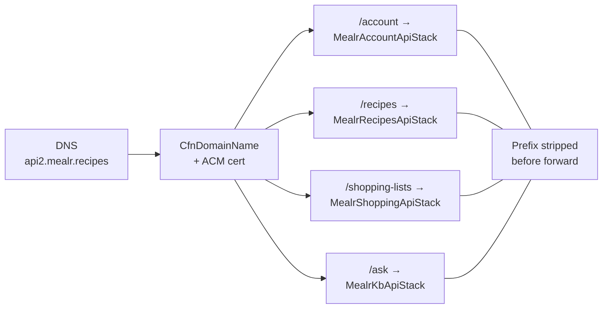

# mealr-api-gateway — repository architecture

Internal architecture of **this repository** (Mermaid). For the full Mealr platform, see [`ARCHITECTURE.md`](ARCHITECTURE.md).

## Table of Contents

- [Overview](#overview)
- [Diagram](#diagram)
- [Key components](#key-components)
- [Related docs](#related-docs)

---

## Overview

Regional custom domain with four HTTP API v2 base-path mappings. No Lambda, JWT validation, or business logic in this stack.

**Infrastructure entry:** `infra/gateway_stack.py`

---

## Diagram

---

## Key components

| Component | Role |
|-----------|------|
| `infra/gateway_stack.py` | `_MAPPINGS`: account, recipes, ask, shopping-lists |
| `infra/config.py` | Resolves downstream `ApiId` via CloudFormation `DescribeStacks` |
| `cdk-params.json` | Domain name, certificate ARN, optional stack name overrides |

---

## Related docs

| Document | Scope |
|----------|--------|
| [`ARCHITECTURE.md`](ARCHITECTURE.md) | Whole Mealr platform (all repos) |
